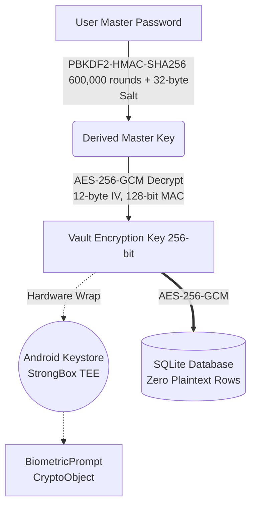

<div align="center">


# Kryptx
### Zero-Knowledge • Post-Quantum • Offline-First Native Android Fortress

<p align="center">
  <a href="https://developer.android.com"></a>
  <a href="https://kotlinlang.org"></a>
  <a href="https://www.rust-lang.org/"></a>
  <a href="https://developer.android.com/jetpack/compose"></a>
  <br>
  <a href="https://github.com/CodeSorcerer-007/Kryptx"></a>
  <a href="https://github.com/CodeSorcerer-007/Kryptx"></a>
  <a href="https://github.com/CodeSorcerer-007/Kryptx/releases"></a>
  <a href="LICENSE"></a>
</p>

**Kryptx is an ultra-secure, zero-knowledge, post-quantum fortified, offline-first native Android password manager, multi-factor authenticator, passkey vault, and encrypted document fortress.**

*Built from the ground up for privacy maximalists, security professionals, and sovereign individuals who refuse to surrender their cryptographic keys to cloud servers.*

</div>

---

## ⚡ The Tech Stack
Kryptx leverages the most powerful modern frameworks and languages to achieve military-grade security and buttery smooth 120fps performance.

| Category | Technology & Tools | Purpose |
|:---|:---|:---|
| **Core Architecture** | **Kotlin & Android 16 (API 36)** | Modern native Android edge-to-edge framework. |
| **Crypto Engine** | **Rust (via JNI/UniFFI)** | Bare-metal performance for cryptographic algorithms. |
| **Post-Quantum** | **ML-KEM-768 (Kyber)** | NIST FIPS 203 quantum-resistant key encapsulation. |
| **UI / UX** | **Jetpack Compose (Material 3)** | Reactive, declarative UI with fluid spring physics. |
| **Database** | **Room & SQLite (WAL Mode)** | Zero-plaintext offline local encrypted data persistence. |
| **Hardware Sec** | **Android Keystore & StrongBox** | TEE isolation, Hardware Key Attestation. |
| **Scanning** | **CameraX API** | Real-time offline QR decoding in volatile RAM. |

---

## 🏛️ Cryptographic Architecture (Zero-Knowledge)

Kryptx operates on a strict **Mathematical Zero-Knowledge** and **Sovereign Offline-First** model. Plaintext credentials, private keys, and biometric states are **never transmitted over the internet, never logged, and never stored unencrypted.**



### 🔒 Military-Grade Defenses
*   ⚛️ **Post-Quantum Cryptography**: Hybrid ML-KEM-768 (Kyber) + ECDH + HKDF-SHA256 for future-proof quantum resistance.
*   🛡️ **Hardware-Backed OS Attestation**: Cryptographic TEE Key Attestation verified against the root of trust. Spoofed boot states (like Magisk) are mathematically blocked.
*   🧠 **Native Memory Locking (JNI)**: Rust executes `mlock` and `madvise(MADV_DONTDUMP)` to pin cryptographic buffers in physical RAM, completely preventing OS swapping to disk, and zeroing arrays (`SecureMemory`) after use to eliminate heap inspection.
*   ⚔️ **Runtime Anti-Tamper Engine**: Defense-in-depth heuristic scanner checking `/proc/self/maps` for known hook signatures (Frida, Xposed), active debugger detection, and su/magisk binaries.
*   🚫 **Strict Network Isolation**: Zero cleartext traffic allowed across all network stacks (`cleartextTrafficPermitted="false"`).
*   👁️ **Anti-Screen & Clipboard Shield**: Dynamic `FLAG_SECURE` window protection and auto-clearing sensitive clipboard copy timers (30s).

---

## 🚀 Mind-Blowing Features

### 🎨 1. Deterministic Offline Identicons (Zero Network)
*   **40+ Curated Brand Palettes**: High-resolution vector badges for global brands.
*   **Deterministic Monograms**: Derives high-contrast geometric initials and complementary accent colors for any arbitrary domain with **0 network requests, 0 CDN leaks, and 0 latency**.

### 💻 2. Desktop Web Companion (Local Wi-Fi)
*   **PC & Mac Desktop Access**: Manage your encrypted vault directly from any desktop browser over local Wi-Fi.
*   **Zero Cloud Footprint**: Runs an ephemeral, local HTTP daemon with 6-digit cryptographic PIN handshakes and expiring session tokens. No desktop software required.

### 📄 3. Printable Emergency Recovery Kit
*   **Offline Master Custody**: Generates a 1-page **native Vector PDF** emergency sheet containing vault cryptographic parameters, safe deposit instructions, and an offline encrypted recovery QR key.

### 🔑 4. Built-in Real-Time TOTP 2FA Authenticator (RFC 6238)
*   Animated circular progress countdown rings with 30-second time steps.
*   Supports SHA-1, SHA-256, and SHA-512 with 6/8-digit codes in high-readability monospace font.
*   **Offline CameraX Scanner**: Decode TOTP QR codes directly in volatile RAM with zero persistent image caching.

### 🗂️ 5. The 12-Vault Multi-Category System
1. 🔑 **Logins**: Web, Username, Password, TOTP, Notes.
2. 🪪 **Passkey & FIDO2**: Relying Party ID, Credential ID, ES256 P-256.
3. 💳 **Credit & Debit Cards**: Luhn validation, Expiry, CVV, PIN.
4. 👤 **Identities**: Full Name, Email, Address, DOB, Passport / National ID.
5. 📝 **Secure Notes**: Confidential encrypted multi-line records.
6. 📶 **Wi-Fi Credentials**: Protocol (WPA2/WPA3), offline QR Code generator.
7. ⚡ **API Keys & Tokens**: Endpoint, Key ID, Secret Token.
8. 🏦 **Bank Accounts**: Routing, SWIFT/BIC.
9. 🪙 **Crypto Wallets**: Network, Public Address, Recovery Seed Phrase.
10. 🖥️ **SSH Keys**: Host, Public/Private Key (`.pem` support).
11. 🩺 **Medical & Emergency**: Blood Type, Allergies, Emergency Contacts.
12. 🧩 **Custom Fields**: User-defined key-value fields.

### 📊 6. Security Pulse & Breach Radar
*   **0–100 Vault Health Score** with dynamic letter grades (`A+` to `F`).
*   **Privacy-Preserving Breach Detection (k-Anonymity)**: HIBP Range API queries with `Add-Padding: true` (only the first 5 characters of SHA-1 leave the device).

### 🤖 7. Native Android 14+ System Integrations
*   **Credential Provider Framework**: Native Android 14+ Passkey (WebAuthn / FIDO2) and Password provider integration.
*   **Autofill Framework**: Native autofill provider matching package names and web domains across Android apps and Chrome.

---

## 💎 Design System & Tactile Physics

Kryptx isn't just secure; it is a sensory, ultra-premium experience that feels alive.

*   🪞 **True Frosted Glassmorphism**: Multi-layered translucent surface cards featuring 1px luminous specular gradient borders (`KryptxCyan -> KryptxViolet -> Specular White`).
*   ⚛️ **Framer-Motion-Like Spring Physics**: Interactive micro-interactions on all cards, buttons, and category chips with spring bounce scale physics (`0.96f` on press).
*   📳 **Tactile Haptics Engine (`KryptxHaptics`)**: Crisp vibration feedback tuned for keypresses, copy confirmations, slider ticks, and biometric triggers.
*   🎨 **4 Curated Color Themes**: **Obsidian Dark**, **Pure Black (AMOLED)**, **Solar Light**, and **Material You (Dynamic Color)**.

---

## 🛡️ Threat Model & Defense Matrix

| Attack Vector | Vulnerability in Standard Apps | 🟢 Kryptx Cryptographic Defense |
|:---|:---|:---|
| **Brute-Force Master Key** | 🔴 Weak dictionary cracking | **PBKDF2-HMAC-SHA256 (600,000 iters)** + 32-byte secure salt. |
| **Quantum Decryption** | 🔴 RSA/ECC broken by Shor's | **Post-Quantum ML-KEM-768 (Kyber)** key encapsulation. |
| **RAM / Memory Dump** | 🔴 Plaintext keys sitting in heap | **JNI Memory Locking (`mlock`)** + byte-level zeroization. |
| **Timing Side-Channels** | 🔴 String `equals` leaking timing | **Constant-Time comparisons** on byte/char arrays. |
| **Hardware Keystore Hack** | 🔴 Software-only keystore keys | **Hardware StrongBox / TEE** + Boot Attestation. |
| **Malicious Background Hooks** | 🔴 Frida / Xposed script injection | **Runtime Anti-Tamper scanner** + Root Detection. |
| **Screen / Clipboard Leaks** | 🔴 Spyware captures screen/clipboard | **Hardware `FLAG_SECURE`** + 30s clipboard zeroization. |
| **Cloud Breaches** | 🔴 Server database leaked/seized | **100% Offline Zero-Knowledge architecture**. |

---

## 📂 Project Architecture

```text
app/src/main/java/com/kryptx/app/
├── core/
│   ├── crypto/         # Rust Engine, Post-Quantum, Passkeys, SecureMemory (mlock)
│   ├── database/       # Room SQLite (WAL + Vacuum)
│   ├── designsystem/   # Glassmorphism, Haptics, Spring Physics, Identicons
│   ├── security/       # RootDetector (Attestation), BreachChecker, Anti-Tamper
│   └── sync/           # LocalWebCompanionServer (Zero-Cloud Desktop Wi-Fi)
├── feature/            # Jetpack Compose Screens (Auth, Vault, TOTP, Generator)
└── system/autofill/    # CredentialProviderService, AutofillService
```

---

## 🧪 Building & Testing

### Prerequisites
*   Android Studio Ladybug / Meerkat (or IntelliJ IDEA)
*   JDK 21+
*   Android SDK 36 (Android 16)
*   **Rust (cargo)** (for compiling the `kryptx_crypto` JNI engine)

### Run Unit Tests (340 Passing)
```bash
./gradlew testDebugUnitTest
```

### Build Debug APK
```bash
./gradlew assembleDebug
```

### Build Production Release (R8 / ProGuard Optimized)
```bash
./gradlew assembleRelease
```

---

## 📄 License

```text
Copyright 2026 Kryptx Contributors

Licensed under the Apache License, Version 2.0 (the "License");
you may not use this file except in compliance with the License.
You may obtain a copy of the License at

    http://www.apache.org/licenses/LICENSE-2.0
```
