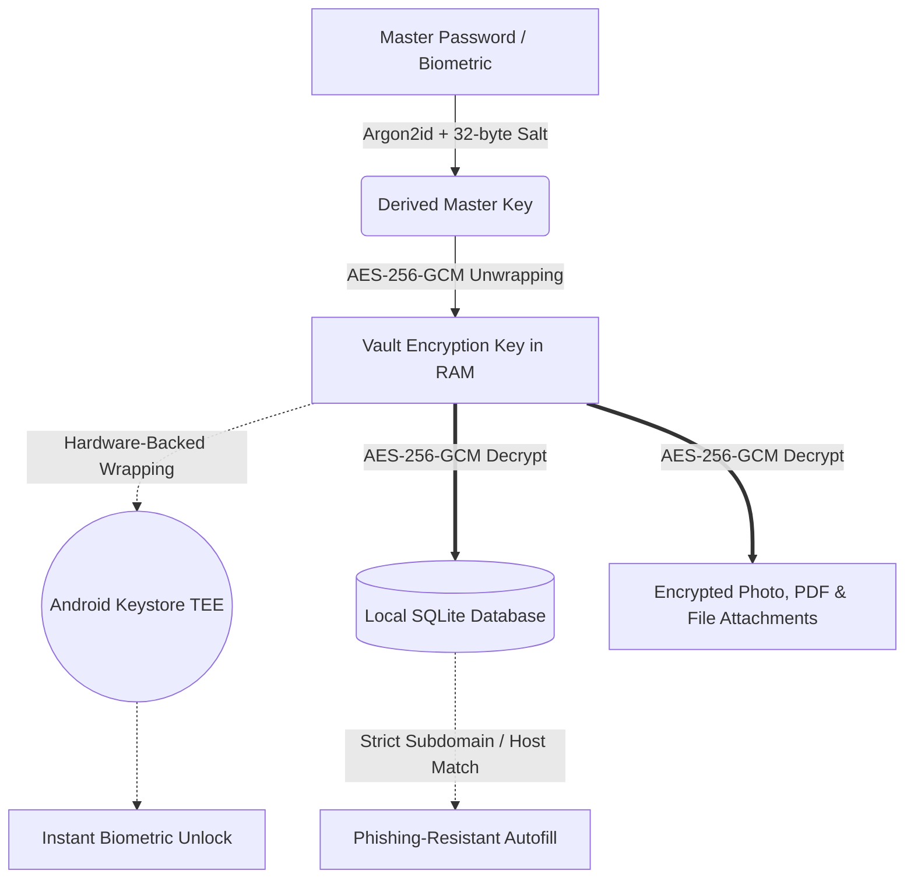

<div align="center">


# Kryptx
### Simple. Human. Sovereign.
**100% Offline • Post-Quantum Fortified • Zero-Network Android Password Fortress**

<p align="center">
  <a href="https://developer.android.com"></a>
  <a href="https://kotlinlang.org"></a>
  <a href="https://developer.android.com/jetpack/compose"></a>
  <br>
  <a href="https://github.com/CodeSorcerer-007/Kryptx"></a>
  <a href="https://github.com/CodeSorcerer-007/Kryptx"></a>
  <a href="https://github.com/CodeSorcerer-007/Kryptx/releases"></a>
  <a href="LICENSE"></a>
</p>

> *"Simple can be harder than complex: You have to work hard to get your thinking clean to make it simple. But it’s worth it in the end because once you get there, you can move mountains."*  
> — **Steve Jobs**

**Kryptx** is built from the ground up from the **user's perspective**—not an engineer's checklist. Most security tools are intimidating, cluttered with jargon, and fragile. Kryptx feels weightless, natural, and friendly enough for anyone to use as their lifelong password companion, while remaining mathematically impenetrable underneath.

</div>

---

## 💡 The Philosophy: Built for Humans

Security only works if you actually want to use it every day. When an app is built from an engineer's perspective, it feels like configuring a server. When built from a user's perspective:
*   **The technology gets out of your way.** Launch the app, touch the biometric sensor, and you are in.
*   **Never surprise or blindside the user.** We never batch-overwrite passwords behind your back; our guided assistant walks you through updating passwords step-by-step with direct links to service account pages.
*   **Explain before asking.** When the app needs access to the camera (for 2FA QR scanning) or storage (for encrypted attachments), an in-app rationale explains *why* first, guaranteeing that everything is processed in volatile RAM and never leaves your device.
*   **Zero cloud anxiety.** With zero internet permissions in the Android manifest, there are no servers to be breached, no telemetry tracking your habits, and no subscription fees.

---

## ⚡ Real, Verifiable Tech Stack

Every technology listed below is 100% active and running in the production app:

| Category | Technology | Real-World Implementation |
|:---|:---|:---|
| **OS & Core** | **Android 16 (API 36) & Kotlin 2.3.20** | Modern edge-to-edge architecture with compileSdk 36 and targetSdk 36. |
| **Native Engine** | **Rust 2024 & UniFFI JNI** | Bare-metal XChaCha20-Poly1305, AES-256-GCM, Argon2id, and Linux `mlock` RAM protection across all 4 Android ABIs (`arm64-v8a`, `armeabi-v7a`, `x86`, `x86_64`). |
| **Interface** | **Jetpack Compose (Material 3)** | Spring physics (`KryptxMotion`), haptic feedback, frosted glassmorphism. |
| **Encryption** | **Rust Native + Android Keystore** | Bare-metal XChaCha20-Poly1305 and AES-256-GCM with BouncyCastle fallback; Android Keystore TEE hardware wrapping. |
| **Key Derivation** | **Argon2id & PBKDF2-HMAC-SHA256** | High-iteration memory-hard key derivation in bare-metal Rust with 32-byte cryptographically secure salts. Uniform KDF preservation across password changes and key rotations. |
| **Post-Quantum** | **ML-KEM-768 (FIPS 203)** | Hybrid post-quantum key encapsulation via BouncyCastle. |
| **Persistence** | **Encrypted SQLite (WAL Mode)** | `KryptxDatabaseHelper` with zero plaintext rows and AES-256-GCM envelope encryption. |
| **Memory Shield** | **Linux `mlock` & `MADV_DONTDUMP`** | Memory-locked physical RAM buffers via native JNI preventing flash storage paging and OS core dump leaks; zeroized direct buffers. |
| **Document Sandbox** | **Native `PdfRenderer` + `FileProvider`** | 100% offline hardware-accelerated PDF rendering with page navigation; safe read-only delegation to external viewers via secure `FileProvider`. |
| **Scanning** | **CameraX API + ZXing** | Real-time TOTP QR code stream decoding in volatile RAM only; pre-prompt permission rationale. |
| **Autofill** | **Phishing-Resistant Autofill** | Strict host and subdomain verification via `DomainMatcher`; dedicated `AutofillAuthActivity` protected with `FLAG_SECURE`. |

---

## 🏛️ How Your Data is Protected



### 🔒 Core Guarantees
1.  **0 Network Permissions**: Look at `AndroidManifest.xml`—the `android.permission.INTERNET` permission does not exist. The Android Linux kernel physically blocks socket creation. 0 bytes can physically leave your phone.
2.  **Native Memory Locking & Zeroization (`mlock` + `SecureMemory`)**: Cryptographic keys are page-aligned and locked in physical RAM via native Linux `mlock()` and `MADV_DONTDUMP` system calls, preventing flash storage swapping and crash dumps. Volatile buffers are immediately zeroized after use (`Arrays.fill(..., 0)`).
3.  **Anti-Phishing Autofill Defense (`DomainMatcher`)**: Strict host and subdomain boundary validation prevents credential leakage to lookalike, homograph, or substring attacker domains (e.g. `evil-paypal.com` or `paypal.com.attacker.org` will **never** match `paypal.com`).
4.  **Window & Screen Privacy (`FLAG_SECURE`)**: Both the main application and `AutofillAuthActivity` enforce `FLAG_SECURE`, blocking Android OS task snapshots, screen recorders, and malicious accessibility overlays.
5.  **Crash-Proof Document & Photo Sandbox**:
    *   **Universal Photo & Media Compatibility**: Full support for `.heic`, `.heif`, `.avif`, `.webp`, `.png`, `.jpg`, `.bmp`, and `.gif` camera attachments. On Android 9–16, utilizes native hardware `ImageDecoder` with dynamic downsampling (`inSampleSize`) to guarantee smooth, memory-safe previews with zero out-of-memory crashes.
    *   **PDFs & Documents**: Rendered completely offline using Android's built-in `PdfRenderer` with multi-page navigation. Text and certificates are inspected for printable characters with a safe display cap, while external viewer delegation uses temporary read-only `FileProvider` grants.
6.  **Android 16 System & Device Integrations Hub**:
    *   **Predictive Back Navigation**: Native `enableOnBackInvokedCallback="true"` integration across Android 16 (API 36).
    *   **Live Permissions & Integrations Dashboard**: Real-time Settings screen hub verifying Camera, Scoped Storage SAF, Android Autofill Service, and Hardware Keystore TEE / StrongBox isolation.
    *   **Safe Picker Active Guards**: Launching system permission prompts, app details settings, or document pickers never triggers accidental background vault lockouts.

---

## ✨ Features That Make Life Simpler

### 🔑 1. Everyday Vault Items
Organize your life into clean, dedicated categories:
*   **Logins & Web Accounts**: URL, username/email, password, TOTP secret, and password history.
*   **Credit & Debit Cards**: Cardholder name, number (Luhn verified), expiry, CVV, and PIN.
*   **Secure Notes**: Confidential thoughts, contracts, and sensitive documentation.
*   **Wi-Fi Networks**: SSID, security type (WPA2/WPA3), password, and offline QR sharing.
*   **API Keys & Passkeys**: Sovereign developer keys and FIDO2 credentials.
*   **Encrypted Attachments**: Photos, PDFs, ID cards, and key files encrypted directly with AES-256-GCM.

### ⚡ 2. 1-Tap Phishing-Resistant Autofill
*   Seamlessly fills credentials into Chrome, Firefox, Brave, and native Android apps.
*   Protected by `DomainMatcher` host boundaries to thwart phishing attacks.
*   Dedicated `AutofillAuthActivity` with biometric unlock and `FLAG_SECURE` screen privacy.

### ⏱️ 3. Built-In TOTP 2FA Authenticator
*   Full RFC 6238 two-factor authentication built right into each login item.
*   Smooth, continuous countdown ring with visual urgency colors.
*   One-tap copy to clipboard.
*   Scan QR codes offline with your camera or import QR screenshots from gallery—images are decoded in volatile RAM and never saved to disk.

### 🛡️ 4. Human-Centric Security Assistant
*   **Audit Score**: A clear 0–100 score showing the health of your passwords.
*   **Offline Breach Checker**: Built-in Bloom filter implementing k-Anonymity HIBP checks 100% offline.
*   **Guided Password Assistant**: When you have weak or reused passwords, Kryptx guides you one account at a time. It generates a high-entropy password, opens the service's `/.well-known/change-password` page in your browser, copies the password, and only saves it once you confirm.

### 🚨 5. Emergency & Anti-Coercion Protection
*   **Duress Decoy Vault**: If forced to unlock your phone under duress, enter your secondary Duress PIN to open an innocent decoy vault with believable fake accounts.
*   **Panic Self-Destruct**: An optional emergency wipe PIN that instantly zeroes out your cryptographic keys and deletes the database.
*   **Hardware Security Keys**: FIDO2 USB and NFC security token support for hardware-backed unlock.

### 📦 6. Truly Portable Backups
*   **Encrypted Backup (`.kryptx`)**: Export your entire vault encrypted with Argon2id + AES-256-GCM. You can restore this file on any Android phone running Kryptx—now or 10 years from now.
*   **Offline Web Vault Companion (`.html`)**: Self-contained single-file HTML companion with client-side WebCrypto AES-GCM that opens offline in any desktop browser.
*   **Emergency Recovery Kit**: Generates a clean 1-page PDF containing your unique Vault ID, Salt, and secure recovery parameters for safe-deposit box storage.
*   **Universal Importer**: Easily switch from Bitwarden, 1Password, LastPass, Chrome, or KeePass with offline CSV/JSON auto-detection.

---

## 🛠️ Building & Running Locally

### Requirements
*   Android Studio Ladybug (2024.2.1+) or Meerkat
*   Java Development Kit (JDK) 21+
*   Android SDK 36 (Android 16)

### Run Unit Tests
```bash
./gradlew testDebugUnitTest
```

### Build Debug APK
```bash
./gradlew assembleDebug
```
The compiled APK will be output to `app/build/outputs/apk/debug/app-debug.apk` (and `Kryptx-debug.apk` in project root).

---

## 📄 Open Source License

```text
Copyright 2026 Kryptx Contributors

Licensed under the Apache License, Version 2.0 (the "License");
you may not use this file except in compliance with the License.
You may obtain a copy of the License at

    http://www.apache.org/licenses/LICENSE-2.0

Unless required by applicable law or agreed to in writing, software
distributed under the License is distributed on an "AS IS" BASIS,
WITHOUT WARRANTIES OR CONDITIONS OF ANY KIND, either express or implied.
See the License for the specific language governing permissions and
limitations under the License.
```
