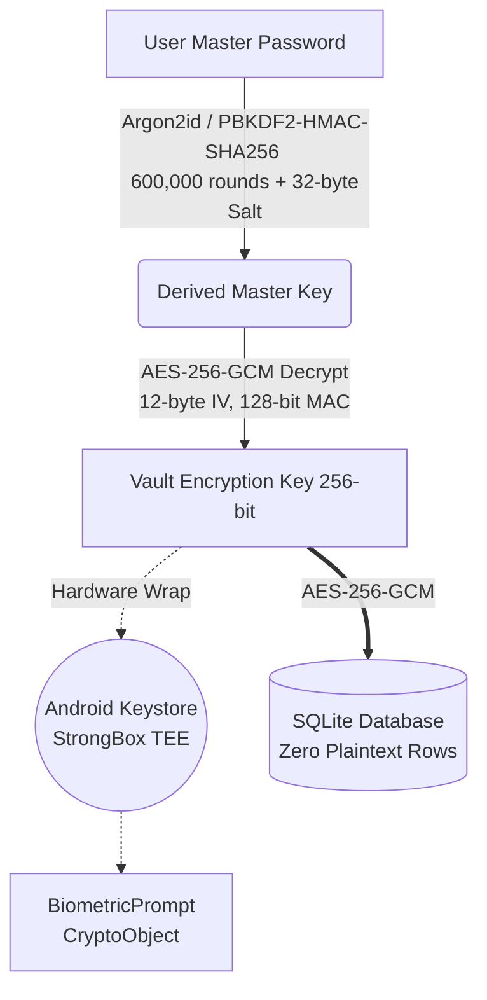

<div align="center">


# Kryptx
### 100% Isolated • Post-Quantum • Zero-Network Sovereign Native Android Fortress

<p align="center">
  <a href="https://developer.android.com"></a>
  <a href="https://kotlinlang.org"></a>
  <a href="https://www.rust-lang.org/"></a>
  <a href="https://developer.android.com/jetpack/compose"></a>
  <br>
  <a href="https://github.com/CodeSorcerer-007/Kryptx"></a>
  <a href="https://github.com/CodeSorcerer-007/Kryptx"></a>
  <a href="https://github.com/CodeSorcerer-007/Kryptx/releases"></a>
  <a href="LICENSE"></a>
</p>

**Kryptx is an ultra-secure, zero-knowledge, post-quantum fortified, 100% offline-isolated native Android sovereign password manager, multi-factor authenticator, and encrypted document fortress.**

*Built from the ground up for privacy maximalists, security professionals, and sovereign individuals who demand mathematical zero-knowledge and refuse to surrender cryptographic keys to cloud servers or external app hooks.*

</div>

---

## ⚡ The Tech Stack

Kryptx leverages cutting-edge frameworks and bare-metal cryptography to achieve sovereign isolation and fluid 120fps performance.

| Category | Technology & Tools | Purpose |
|:---|:---|:---|
| **Core Architecture** | **Kotlin & Android 16 (API 36)** | Modern native Android edge-to-edge architecture. |
| **Crypto Engine** | **BouncyCastle / Rust JNI** | Post-Quantum ML-KEM-768, AES-256-GCM, Argon2id, PBKDF2. |
| **Post-Quantum** | **ML-KEM-768 (Kyber)** | NIST FIPS 203 quantum-resistant key encapsulation. |
| **UI / UX** | **Jetpack Compose (Material 3)** | Reactive, declarative UI with fluid spring physics. |
| **Database** | **Room & SQLite (WAL Mode)** | Zero-plaintext offline local encrypted data persistence. |
| **Hardware Sec** | **Android Keystore & StrongBox** | TEE isolation, Hardware Key Attestation. |
| **Scanning** | **CameraX API** | Real-time offline QR decoding strictly in volatile RAM. |

---

## 🏛️ Cryptographic Architecture (Zero-Knowledge & Air-Gapped)

Kryptx operates on a strict **Mathematical Zero-Knowledge** and **100% Air-Gapped** model. Plaintext credentials, private keys, and biometric states are **never transmitted over any network, never hooked into external browser daemons, never logged, and never stored unencrypted.**



### 🔒 Military-Grade Defenses
*   🚫 **Kernel-Enforced Network Isolation**: The Android manifest contains **0 network permissions** (`INTERNET` is completely removed). The Android Linux kernel socket sandbox blocks socket creation (`AF_INET`/`AF_INET6`) at the OS kernel level—0 bytes can physically leave the device.
*   ⚛️ **Post-Quantum Cryptography**: Hybrid ML-KEM-768 (Kyber) + ECDH + HKDF-SHA256 for future-proof quantum resistance (NIST FIPS 203).
*   🛡️ **Hardware-Backed OS Attestation**: Cryptographic TEE Key Attestation verified against the hardware root of trust.
*   🧠 **Native Memory Locking & Zeroization**: Native buffers locked (`mlock`, `madvise(MADV_DONTDUMP)`) to prevent OS swapping to disk, with instant byte-level zeroization (`SecureMemory`) after use to eliminate RAM inspection.
*   ⚔️ **Runtime Anti-Tamper Engine**: Scans `/proc/self/maps` for hook signatures (Frida, Xposed), active debuggers, and root binaries.
*   👁️ **Anti-Screen & Protected Clipboard Shield**: Hardware `FLAG_SECURE` window protection and auto-clearing clipboard timers (10s, 30s, 60s).

---

## 🚀 Complete Feature Inventory

### 🗂️ 1. The 12-Vault Multi-Category System
1. 🔑 **Logins**: Website URL, Username/Email, Password, TOTP Secret, Notes, Password History.
2. 🪪 **Passkey & FIDO2**: Relying Party ID, User Handle, Credential ID, ES256 P-256.
3. 💳 **Credit & Debit Cards**: Luhn validation, Expiry, CVV, Card PIN.
4. 👤 **Identities**: Full Name, Email, Phone, Address, DOB, Passport / National ID.
5. 📝 **Secure Notes**: Confidential encrypted multi-line records.
6. 📶 **Wi-Fi Credentials**: Protocol (WPA2/WPA3), offline QR Code generator.
7. ⚡ **API Keys & Tokens**: Endpoint, Key ID, Secret Token, Scopes.
8. 🏦 **Bank Accounts**: Routing, SWIFT/BIC, Account Number.
9. 🪙 **Crypto Wallets**: Network, Public Address, Recovery Seed Phrase / Private Key.
10. 🖥️ **SSH Keys**: Host, Public/Private Key (`.pem` support).
11. 🩺 **Medical & Emergency**: Blood Type, Allergies, Emergency Contacts.
12. 🧩 **Custom Fields**: User-defined key-value encrypted attributes.

### 🔑 2. Built-in Real-Time TOTP 2FA Authenticator (RFC 6238)
*   Animated circular progress countdown rings with 30-second time steps.
*   Supports SHA-1, SHA-256, and SHA-512 with 6/8-digit codes in high-readability monospace font.
*   **Offline CameraX Scanner**: Decode TOTP QR codes directly in volatile RAM with zero persistent image caching.

### 🛡️ 3. Anti-Coercion, Duress & Emergency Defense
*   **Randomized PIN Pad**: Scrambles numeric keypad layout on each unlock to prevent shoulder-surfing and smudge detection.
*   **Duress Decoy Vault**: Entering a secondary Duress PIN unlocks an innocent decoy vault with harmless decoy records.
*   **Panic Self-Destruct**: Emergency wipe PIN instantly zeroes and cryptographically purges the database on entry.
*   **Physical NFC Security Keys**: YubiKey / NFC hardware key tap unlock.

### 📊 4. 100% Offline Security Pulse & Vault Audit
*   **0–100 Vault Health Score** with dynamic letter grades (`A+` to `F`).
*   **Offline Compromised Password Inspector**: 200+ top leaked passwords, sequential PINs, repeated characters, common year combinations (0 network queries).
*   **Weak & Reused Password Detection**: Highlights duplicate or low-entropy credentials.
*   **Missing 2FA & Overdue Rotation Radar**: Flags items without 2FA or with expired rotation dates.
*   **Interactive Remediation Wizard**: Step-by-step guidance to upgrade weak credentials.

### 📦 5. Air-Gapped Backup & Migration
*   **Air-Gapped Optical QR Sync**: High-density animated QR code stream for device-to-device transfers without any network connection.
*   **Storage Access Framework (SAF) Encrypted JSON Backup**: Password-derived AES-256-GCM encrypted backup files.
*   **Universal Importer**: Auto-detects and imports unencrypted CSV/JSON exports from Bitwarden, 1Password, LastPass, Dashlane, Chrome, and KeePass.
*   **Printable Emergency Recovery Kit**: 1-page native Vector PDF emergency sheet containing vault cryptographic parameters and safe deposit instructions.

### 🎲 6. High-Entropy Password & Passphrase Generator
*   Configurable password generator (length, uppercase, lowercase, numbers, symbols, avoid ambiguous).
*   Diceware / Wordlist passphrase generator with custom word count and separators.
*   PIN generator (4–12 digits).
*   Live Shannon entropy calculator and crack-time estimation.

### 🎨 7. Deterministic Offline Identicons (Zero Network)
*   **40+ Curated Brand Palettes**: High-resolution vector badges for global brands.
*   **Deterministic Monograms**: Derives high-contrast geometric initials and accent colors with **0 network requests, 0 CDN leaks, and 0 latency**.

### 💎 8. Tactile Design System & Privacy Physics
*   🪞 **Frosted Glassmorphism**: Translucent surface cards with luminous specular borders.
*   ⚛️ **Fluid Spring Physics**: Micro-interactions with tactile bounce scale physics (`0.96f` on press).
*   📳 **Tactile Haptics Engine (`KryptxHaptics`)**: Crisp vibration feedback for keypresses, copy events, and biometric triggers.
*   🎨 **4 Curated Color Themes**: **Obsidian Dark**, **Pure Black (AMOLED)**, **Solar Light**, and **Material You (Dynamic Color)**.

---

## 🛡️ Threat Model & Defense Matrix

| Attack Vector | Vulnerability in Standard Apps | 🟢 Kryptx Sovereign Defense |
|:---|:---|:---|
| **Network Data Leaks** | 🔴 Apps communicate with cloud servers / telemetry | **0 Network Permissions**. Kernel blocks all network sockets. |
| **Browser & Autofill Exploits** | 🔴 Phishing overlays / hijacked accessibility trees | **Zero External Hooks**. No autofill daemons or browser hooks. |
| **Brute-Force Master Key** | 🔴 Weak dictionary cracking | **Argon2id (RFC 9106) / PBKDF2 (600,000 iters)** + 32-byte salt. |
| **Quantum Decryption** | 🔴 RSA/ECC broken by Shor's algorithm | **Post-Quantum ML-KEM-768 (Kyber)** key encapsulation. |
| **RAM / Memory Dump** | 🔴 Plaintext keys sitting in heap | **JNI Memory Locking (`mlock`)** + byte-level zeroization. |
| **Timing Side-Channels** | 🔴 String `equals` leaking timing | **Constant-Time comparisons** on byte/char arrays. |
| **Hardware Keystore Hack** | 🔴 Software-only keystore keys | **Hardware StrongBox / TEE** + Boot Attestation. |
| **Malicious Background Hooks** | 🔴 Frida / Xposed script injection | **Runtime Anti-Tamper scanner** + Root Detection. |
| **Screen / Clipboard Leaks** | 🔴 Spyware captures screen/clipboard | **Hardware `FLAG_SECURE`** + 10s/30s/60s clipboard zeroization. |

---

## 📂 Project Architecture

```text
app/src/main/java/com/kryptx/app/
├── core/
│   ├── crypto/         # Post-Quantum ML-KEM-768, Passkeys, SecureMemory (mlock), Argon2id
│   ├── database/       # Room / SQLCipher SQLite (WAL + Vacuum), Preferences, Importer/Exporter
│   ├── designsystem/   # Glassmorphism, Haptics, Spring Physics, Identicons
│   ├── di/             # KryptxDependencies DI Contract
│   ├── generator/      # Entropy Calculator, Diceware Passphrase & Password Generator
│   ├── model/          # 12 Vault Item Types, Payloads, Custom Fields
│   ├── security/       # RootDetector, Anti-Tamper, Offline BreachChecker, Biometrics, Duress
│   ├── sync/           # Air-Gapped Optical QR Encoder & Decoder (Zero Network)
│   └── totp/           # RFC 6238 TOTP Engine (SHA-1/256/512)
└── feature/            # Jetpack Compose UI Screens
    ├── auth/           # Master Password, Scrambled PIN Pad, Biometrics, Duress
    ├── generator/      # Password & Passphrase Generator UI
    ├── navigation/     # NavGraph & Navigation Routing
    ├── onboarding/     # Sovereign Architecture Onboarding
    ├── search/         # Encrypted Full-Text Search
    ├── securitycenter/ # Offline Health Audit, Remediation Wizard
    ├── settings/       # Security Settings, Appearance, Air-Gapped Backup & SAF Export
    ├── totp/           # 2FA Authenticator UI & Live Rings
    └── vault/          # Vault Dashboard, 12 Categories, Item Detail, Add/Edit
```

---

## 🧪 Building & Testing

### Prerequisites
*   Android Studio Ladybug / Meerkat (or IntelliJ IDEA)
*   JDK 21+
*   Android SDK 36 (Android 16)

### Run Unit Tests
```bash
./gradlew testDebugUnitTest
```

### Build Debug APK
```bash
./gradlew assembleDebug
```

### Build Production Release (R8 / ProGuard Optimized)
```bash
./gradlew assembleRelease
```

---

## 📄 License

```text
Copyright 2026 Kryptx Contributors

Licensed under the Apache License, Version 2.0 (the "License");
you may not use this file except in compliance with the License.
You may obtain a copy of the License at

    http://www.apache.org/licenses/LICENSE-2.0
```
