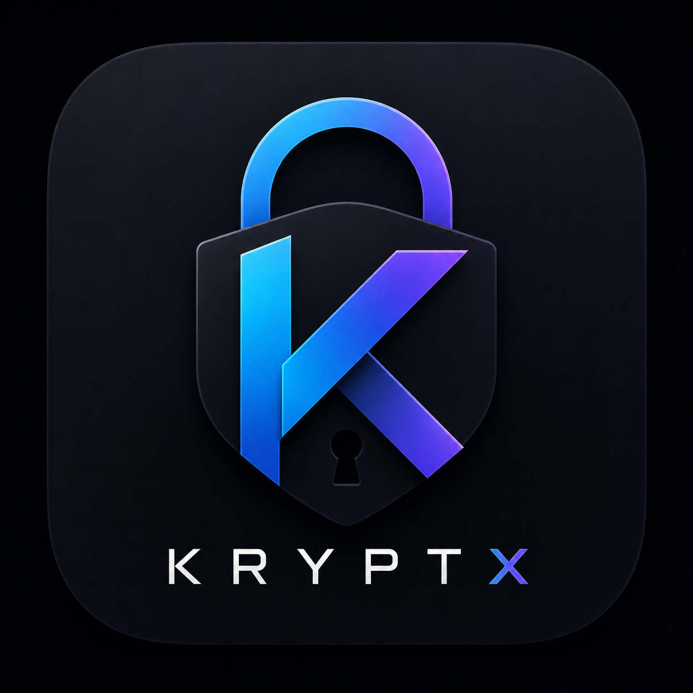

# 🛡️ Kryptx — Flagship Native Android Password Manager

<div align="center">



[-00E676?style=for-the-badge&logo=android&logoColor=white)](https://developer.android.com)
[](https://kotlinlang.org)
[](https://developer.android.com/jetpack/compose)
[](https://github.com/CodeSorcerer-007/Kryptx/actions)
[](LICENSE)

**An ultra-secure, zero-knowledge, offline-first native Android password manager & multi-factor authenticator engineered for Android 16.**

</div>

---

## 🏛️ Security Architecture & Cryptographic Foundations

Kryptx is engineered around a **Zero-Knowledge, Offline-First** security model. Master passwords, private keys, TOTP seeds, and sensitive records are never transmitted over the network, never logged, and never stored in unencrypted persistent storage.

```
┌─────────────────────────────────────────────────────────────┐
│                    User Master Password                     │
└─────────────────────────────────────────────────────────────┘
                               │
                               │ PBKDF2WithHmacSHA256 (600,000 rounds)
                               │ 32-byte cryptographically secure salt
                               ▼
┌─────────────────────────────────────────────────────────────┐
│                     Derived Master Key                      │
└─────────────────────────────────────────────────────────────┘
                               │
                               │ AES-256-GCM Decrypt (12-byte IV, 128-bit MAC)
                               ▼
┌─────────────────────────────────────────────────────────────┐
│             Vault Encryption Key (VEK: 256-bit)             │
└─────────────────────────────────────────────────────────────┘
         │                                             │
         │ Hardware Wrap (Android Keystore)            │ AES-256-GCM Authenticated
         │ StrongBox / TEE Hardware Key                ▼
         ▼                                 ┌─────────────────────────┐
┌─────────────────────────────────┐        │     SQLite Database     │
│   BiometricPrompt.CryptoObject  │        │  (Zero Plaintext Rows)  │
└─────────────────────────────────┘        └─────────────────────────┘
```

### 🔒 Core Cryptographic Specifications

- **Symmetric Encryption**: AES-256 in Galois/Counter Mode (`AES/GCM/NoPadding`) with unique 12-byte initialization vectors (IV) generated per record via `SecureRandom`, coupled with 128-bit authenticated verification tags.
- **Key Derivation Function (KDF)**: `PBKDF2WithHmacSHA256` running **600,000+ iterations** (exceeding OWASP 2024 standards) with 256-bit key output.
- **Hardware-Backed Biometrics**: Cryptographic `BiometricPrompt.CryptoObject` backed by Android Keystore StrongBox Keymaster / TEE hardware isolation.
- **In-Memory Zeroization (`SecureMemory`)**: Raw keys, derived keys, and unencrypted byte buffers are allocated in `CharArray`/`ByteArray` and immediately wiped (`Arrays.fill(..., 0)`) after execution.
- **Privacy-Preserving Breach Detection**: RFC-compliant k-Anonymity breach detection engine querying the Have I Been Pwned API (only 5 characters of SHA-1 prefix leave the device with response padding) plus an instant offline dictionary.
- **Runtime Integrity & Anti-Tamper**: Real-time scanner checking `/proc/self/maps` for Frida/Xposed/Substrate hooking frameworks, active debugger detection, su/magisk binaries, and test-keys.
- **Strict Network Security**: Zero cleartext traffic allowed across all network stacks (`cleartextTrafficPermitted="false"`).
- **Anti-Screen & Clipboard Shield**: Dynamic `FLAG_SECURE` window protection and auto-clearing sensitive clipboard copy timers (30s).

---

## ✨ Features & Capabilities

### 🗂️ 1. Multi-Category Vault Management
1. 🔑 **Logins**: Website/URL, Username/Email, Password, Real-time TOTP Authenticator, Notes, Tags.
2. 💳 **Credit & Debit Cards**: Cardholder, Card Number (Luhn validation), Expiry, CVV, Card PIN.
3. 🪪 **Identities**: Full Name, Email, Phone, Physical Address, DOB, Passport / National ID number.
4. 📝 **Secure Notes**: Confidential encrypted multi-line records.
5. 📶 **Wi-Fi Credentials**: Network SSID, Password, Security Protocol (WPA2/WPA3), QR Code generator.
6. ⚡ **API Keys & Tokens**: Endpoint URL, Key ID, Secret Token, Custom Headers.
7. 🏦 **Bank Accounts**: Bank Name, Account Number, Routing Number, SWIFT/BIC.
8. 🪙 **Crypto Wallets**: Blockchain Network, Public Address, Recovery Seed Phrase.
9. 🖥️ **SSH Keys**: Host, Public Key, Private Key.
10. 🩺 **Medical & Emergency Data**: Patient Name, Blood Type, Allergies & Conditions, Emergency Contacts.
11. 🧩 **Custom Fields**: User-defined key-value fields with masked secret visibility toggles.

### ⏱️ 2. Built-in Real-Time TOTP 2FA Authenticator (RFC 6238)
- Real-time animated circular progress rings with 30-second time steps.
- Supports SHA-1, SHA-256, and SHA-512 with 6 and 8-digit codes.
- Direct parsing of `otpauth://totp/` QR/URIs and manual secret entry.

### 📊 3. Security Pulse & Health Radar
- **0–100 Vault Health Score** with letter grades (`A+`, `A`, `B`, `C`, `D`, `F`).
- Mathematical entropy analysis (NIST/Shannon entropy scoring).
- Identifies **weak passwords**, **password reuse**, **stale passwords (>180 days)**, and **breached credentials**.
- 1-tap navigation to fix compromised items immediately.

### ⚡ 4. Advanced Credential Generator
- **Password Mode**: 8 to 64 characters with uppercase, lowercase, numbers, symbols, and ambiguous character filter (`0, O, 1, l, I`).
- **Passphrase Mode**: Memorable EFF Diceware wordlists with customizable separators and capitalized words.
- **PIN Mode**: 4 to 12 digits with cryptographically secure randomness.
- **Username Mode**: Anonymous alphanumeric identifiers and memorable adjective-noun combinations.

### 🤖 5. Native Android System Integrations
- **Autofill Framework (`AutofillService`)**: Native autofill provider matching package names and web domains to fill usernames and passwords directly in apps and Chrome.
- **Biometric Authentication**: Hardware-backed fingerprint and face recognition unlock.
- **Edge-to-Edge & Gesture Navigation**: Built natively with Jetpack Compose Material 3 Expressive.

### 🚨 6. Duress Password & Decoy Vault (Panic Mode)
- **Coercion-Resistant Decoy Partition**: Configure a secondary panic password in Security Settings.
- **Seamless Camouflage**: Entering the duress password at the unlock screen instantly provisions and displays an isolated, realistic decoy vault (dummy streaming, shopping, Wi-Fi accounts) while keeping the real master vault completely hidden and cryptographically inaccessible.

### 📄 7. Printable Emergency Recovery Kit (PDF Generator)
- **Offline Master Custody**: Generates a 1-page vector PDF emergency sheet containing vault cryptographic parameters, handwriting boxes, safe deposit custody instructions, and an offline encrypted recovery QR key.
- Direct share and print integration via Android `FileProvider`.

### 📎 8. Encrypted Document & Photo Attachments
- **Zero-Knowledge File Sandbox**: Attach passport scans, driver's licenses, `.pem` SSH certificates, or crypto keyfiles directly to any vault entry.
- All file streams are encrypted with AES-256-GCM using the active Vault Encryption Key and stored in the isolated app sandbox with on-demand decrypted previews.

### ⏰ 9. Password Expiration & Scheduled Rotation Reminders
- **Custom Policy Rules**: Define rotation intervals per credential (30, 60, 90, 180, 365 days).
- **Security Radar Flags**: Expired credentials trigger high-priority alerts in the Security Radar with a 1-tap "Rotate Now" remediation action.

### 📡 10. Zero-Cloud Local P2P Vault Sync
- **Local Wi-Fi & Hotspot Beam**: Directly sync encrypted credentials between nearby Android phones, tablets, or devices without cloud servers or internet connections.
- **PIN & Dynamic Session Keys**: Secured with ephemeral AES-256-GCM transfer session keys and a 6-digit handshake verification PIN.

### 📷 11. Offline CameraX Real-Time QR Code Scanner
- Built-in real-time camera viewfinder decoding 2FA TOTP accounts and P2P sync QR codes directly in volatile RAM with zero persistent image caching.

### 📦 12. Encrypted Backup & Cross-Platform Migration
- **Encrypted JSON Archives**: Password-protected backups encrypted with AES-256-GCM.
- **Multi-Manager Importer**: Auto-detects and imports credential exports from **Bitwarden** (JSON/CSV), **1Password** (CSV), and **Google Password Manager** (CSV).
- **RFC 4180 CSV Exporter**: Standard CSV export with explicit confirmation prompts.

---

## 🎨 Design System & Theming

- **Obsidian Dark**: Deep obsidian blacks (`#080B10`) paired with vibrant cyan (`#00E5FF`) and neon emerald (`#00E676`).
- **Pure Black (AMOLED)**: Genuine `#000000` dark mode optimized for OLED battery efficiency and maximum contrast.
- **Solar Light**: Clean daylight theme with deep slate contrast.
- **Dynamic Color (Material You)**: Harmonizes accents with the user's Android wallpaper on Android 12+.

---

## 📂 Architecture & Directory Structure

```
app/src/main/java/com/kryptx/app/
├── KryptxApplication.kt                 # Application lifecycle, auto-lock hooks
├── MainActivity.kt                      # Single-activity Compose host, edge-to-edge
│
├── core/
│   ├── crypto/                          # CryptoEngine, KeyDerivation, KeystoreManager, SecureMemory, EntropyCalculator
│   ├── database/                        # KryptxDatabaseHelper, VaultRepository, PreferencesRepository
│   ├── designsystem/                    # KryptxTheme, Colors, Typography, Components (Cards, Buttons, Badges, ScoreRing)
│   ├── di/                              # KryptxViewModelFactory (Lifecycle-safe DI)
│   ├── generator/                       # GeneratorEngine (Passwords, Passphrases, PINs, Usernames)
│   ├── migration/                       # VaultImporter, VaultExporter
│   ├── model/                           # VaultItem, ItemType, SecurityAuditReport, KryptxResult
│   ├── security/                        # VaultSessionManager, BreachChecker, RootDetector, ClipboardSecurityManager
│   └── totp/                            # TotpGenerator (RFC 6238), Base32, UriParser
│
├── feature/
│   ├── auth/                            # SetupMasterPasswordScreen, UnlockScreen, UnlockViewModel
│   ├── generator/                       # GeneratorScreen, GeneratorViewModel
│   ├── navigation/                      # KryptxNavGraph, Screen, BottomNavTab
│   ├── onboarding/                      # OnboardingScreen
│   ├── search/                          # SearchScreen, SearchViewModel
│   ├── securitycenter/                  # SecurityCenterScreen, SecurityCenterViewModel
│   ├── settings/                        # SettingsScreen, SecuritySettings, AppearanceSettings, BackupExport
│   ├── totp/                            # TotpListScreen, TotpViewModel
│   └── vault/                           # VaultDashboardScreen, VaultItemDetailScreen, AddEditItemScreen, VaultViewModel
│
└── system/
    └── autofill/                        # KryptxAutofillService, AutofillAuthActivity, AutofillFieldDetector
```

---

## 🧪 Testing & CI/CD

Kryptx contains a comprehensive test suite covering cryptographic primitives, ViewModels, migrations, security scanners, and memory hygiene:

```bash
# Run all unit tests
./gradlew testDebugUnitTest

# Assemble Release APK with R8 ProGuard shrinking
./gradlew assembleRelease
```

Automated GitHub Actions CI pipeline is configured in [`.github/workflows/android-ci.yml`](.github/workflows/android-ci.yml).

---

## 🛠️ Tech Stack & Requirements

- **Target SDK**: Android 16 (API 36)
- **Minimum SDK**: Android 8.0 (API 26)
- **Kotlin**: 2.3.20
- **UI Framework**: Jetpack Compose with Material 3 Expressive
- **Security Primitives**: Android Keystore (StrongBox / TEE), AES-256-GCM, PBKDF2-HMAC-SHA256, BiometricPrompt
- **Architecture**: MVVM + Clean Architecture + ViewModelProvider.Factory

---

## 📄 License

```
Copyright 2026 CodeSorcerer-007

Licensed under the Apache License, Version 2.0 (the "License");
you may not use this file except in compliance with the License.
You may obtain a copy of the License at

    http://www.apache.org/licenses/LICENSE-2.0

Unless required by applicable law or agreed to in writing, software
distributed under the License is distributed on an "AS IS" BASIS,
WITHOUT WARRANTIES OR CONDITIONS OF ANY KIND, either express or implied.
See the License for the specific language governing permissions and
limitations under the License.
```
